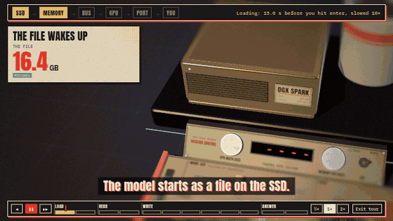

# Desk Space Program

**Your GPU isn't slow. It's starving.** Interactive 3D missions that open up the machines people run AI on and show
what really limits them. Mission 01, Liftoff, puts a model inside a DGX Spark, an RTX 5090, a Mac Studio M3 Ultra,
an AMD Strix Halo mini PC and an RTX Pro 6000, and lets you watch it work: the model lives in the memory chips, and
for every word it writes, the whole model crosses the memory bus while the GPU mostly waits.

**Live: https://tacdelgineer.github.io/desk-space-program/** (Mission 01: [/01-liftoff/](https://tacdelgineer.github.io/desk-space-program/01-liftoff/),
the guided tour: [?tour=life](https://tacdelgineer.github.io/desk-space-program/01-liftoff/?tour=life))



## What you can do

- Pick a machine, a model (or drag the model size from 1B to 200B), a compression level and a prompt, then launch.
  Memory cells fill (one cell is one gigabyte), the bus lanes light up (one lane is 32 bits), and the GPU blocks
  show how much of the chip's math is in use.
- Turn the crew dial to run up to 64 requests at once and see where the GPU finally maxes out, or memory runs out.
- Race the same launch on all five machines, or take the guided tour: one answer, slowed down, from the file on
  the SSD to the last word.
- Open the showroom (V): all five machines side by side on one stand at their real sizes, the same question running
  on all five at once with a ticker over each. Click one to open it up. R puts a desk corner round the stand.
- Use the Mission Control console in front of the machine with a mouse, a touch screen or a MIDI controller.

## Where the numbers come from

Every number in the lab lives in [`labs/data/`](labs/data/) and carries a tag:

- **measured**: run on our own DGX Spark with llama.cpp (`labs/data/measured/`).
- **reported**: someone else's published run or a spec sheet, with a link to it (`labs/data/reported/`,
  `labs/data/machines.json`).
- **estimated**: the lab's own formula (bandwidth and compute; see [`labs/kit/model.js`](labs/kit/model.js)). When a
  machine has a real run of the same model with another prompt length, the estimate is scaled from it and says
  so: *est. from meas.* or *est. from rep.*

No number is typed into the words: the tours and the Mission Reports fill them in from the data files.
`node labs/tools/report.mjs "model=q27&prompt=doc"` prints any setup's numbers with the source of each one.

## Submit a benchmark

Have one of these machines, or another one? [Open a benchmark issue](../../issues/new?template=benchmark.yml)
with your llama.cpp (or MLX) numbers. Accepted runs go into `labs/data/reported/` with a link back to you.

## Run it yourself

No packages needed. With Node 22:

```
node labs/build.mjs                  # writes dist/: one self-contained page per mission, plus the hub
open dist/01-liftoff/index.html      # or any browser; the built page works from a file
```

URL presets set up any state, for example `?machine=mac&model=q27&prompt=doc&shot=3&record=1`
(the full list is at the top of [`labs/missions/01-liftoff/mission.js`](labs/missions/01-liftoff/mission.js)).
Keys: Space launches, O opens the machine, 1-4 move the camera, M switches machines, V the showroom, R the room,
H hides the interface.

`node scripts/check.mjs` builds the site, screenshots its key states on one contact sheet and refuses anything
private in `dist/` (it needs `npm i --no-save playwright` once). The file map is in
[`labs/kit/README.md`](labs/kit/README.md); the design notes in [`labs/HANDOFF.md`](labs/HANDOFF.md); the list of
Shorts in [`EPISODES.md`](EPISODES.md).

## Live mode

On a DGX Spark the same page can run a real model instead of the estimates: you type a question, llama.cpp's
`llama-server` answers it, and the machine on screen lights up from the real thing. The wait for the first word is
the reading, every word that arrives is one pulse, the memory cells show the memory really in use, and power and
temperature come from the GPU itself. A benchmark button runs every downloaded model the same way and writes the
results to `labs/data/measured/spark.json`, which is where the lab's *measured* numbers come from.

It runs through a small bridge, `node live/bridge.mjs`, which builds the lab, starts `llama-server` with the 4-bit
GGUF files named in `labs/data/models.json`, serves the page and prints its address; the page switches into live
mode on its own. It needs llama.cpp built with CUDA. The bridge is not in this repository yet: it is still wired to
one machine's network setup. The page on GitHub Pages always stays the estimate lab.

## Credits

Inspired by Ryan Sael's interactive labs at [sael.net](https://sael.net), in particular the way his
[internet lab](https://sael.net/internet) follows one journey step by step. The guided tour borrows that structure;
the look is our own retro screenprint.

The code is under the [MIT license](LICENSE). Reported numbers belong to the people who published them; each one
links to its source.
